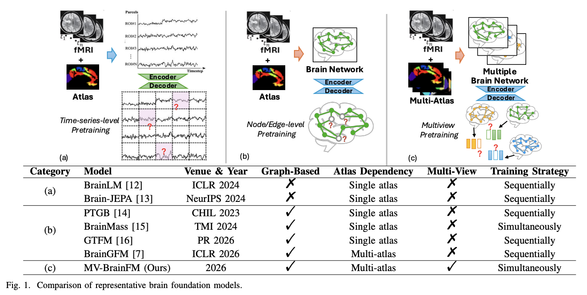

# MV-BrainFM


This is the official PyTorch implementation of MV-BrainFM from the paper 
*"	
Toward a Multi-View Brain Network Foundation Model: Cross-View Consistency Learning Across Arbitrary Atlases"* accepted by IEEE Transactions on Pattern Analysis and Machine Intelligence (TPAMI'26).

Paper Link: [IEEE Xplore](https://ieeexplore.ieee.org/document/11701538)



## Usage

Please check `main.sh` on how to run the project.

## Citation

If you find this code useful, please consider citing our paper:

```
@ARTICLE{11701538,
  author={Xu, Jiaxing and Ma, Jingying and Lin, Xin and Liu, Yuxiao and He, Kai and Lin, Qika and Ke, Yiping and Li, Yang and Shen, Dinggang and Feng, Mengling},
  journal={IEEE Transactions on Pattern Analysis and Machine Intelligence}, 
  title={Toward a Multi-View Brain Network Foundation Model: Cross-View Consistency Learning across Arbitrary Atlases}, 
  year={2026},
  volume={},
  number={},
  pages={1-18},
  keywords={Modeling;Brain;Foundation models;Learning (artificial intelligence);Distance measurement;Head;Neuroimaging;Aging;Educational institutions;Training;Brain Network;fMRI;Foundation Model;Graph Neural Network;Neurological Disorder},
  doi={10.1109/TPAMI.2026.3736359}}

```

## Contact

If you have any questions, please feel free to reach out at `jiaxing003@e.ntu.edu.sg`.
